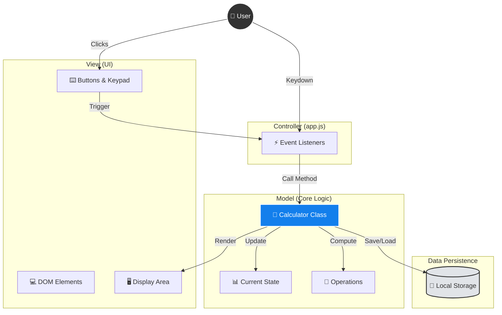

# 🚗 Carculator

**공대생을 위한, 가장 세련된 웹 공학용 계산기**

> "복잡한 공학 계산도, 단순한 산수도. 언제 어디서나 우아하게."

## 📖 프로젝트 소개

**Carculator**는 여러분의 전공 공부와 일상 계산을 도와주는 현대적인 **공학용 전자계산기 웹 애플리케이션**입니다.
기존의 투박한 계산기는 잊으세요. 이제 웹 브라우저만 있으면 PC, 태블릿, 스마트폰 어디서든 쾌적하게 계산할 수 있습니다.

시험 기간 밤샘 공부할 때 눈이 아프지 않도록 **다크 모드**도 완벽하게 지원합니다! 🌙

## ✨ 주요 기능

이 계산기에는 대학생 여러분에게 꼭 필요한 기능들이 담겨 있습니다.

- **🧮 두 가지 모드**:
  - **표준 모드**: 간단한 사칙연산이 필요할 때 가볍게 사용하세요.
  - **공학 모드**: 삼각함수(sin, cos), 로그(log), 지수 등 복잡한 공학 계산도 문제없습니다.
- **🌗 다크 모드 & 라이트 모드**: 여러분의 눈 건강을 위해, 시스템 설정에 맞춰 자동으로 테마가 바뀝니다. (수동 전환도 가능해요!)
- **📝 계산 히스토리**: "아까 그 값 뭐였지?" 당황하지 마세요. 최근 계산 기록이 자동으로 저장되어 언제든 다시 불러올 수 있습니다.
- **📱 반응형 디자인**: 강의실에서는 노트북으로, 이동 중에는 스마트폰으로. 어떤 화면에서도 완벽한 비율을 자랑합니다.

## 🏆 왜 Carculator인가요? (Why Carculator?)

이 프로젝트는 단순한 계산기가 아닙니다. **사용자 경험(UX)과 코드 품질**의 정점을 추구했습니다.

### 1. 디자인의 정점 (Design Excellence)
- **Glassmorphism & Neumorphism**: 최신 디자인 트렌드를 반영한 반투명 유리 효과와 세련된 그림자 처리를 적용했습니다.
- **Space Grotesk Typography**: 공학적 정밀함이 느껴지는 구글 폰트를 사용하여 가독성과 미학을 동시에 잡았습니다.
- **Micro-Interactions**: 버튼 클릭 시 미세한 스케일 변화와 그림자 조정을 통해 마치 실제 버튼을 누르는 듯한 타건감을 시각적으로 구현했습니다.

### 2. 기술적 우수성 (Engineering)
- **Pure Vanilla JS**: 무거운 프레임워크 없이 순수 자바스크립트 클래스(Class) 기반으로 설계하여, 초경량/초고속 퍼포먼스를 자랑합니다.
- **Clean Architecture**: `Calculator` 클래스 내에 상태 관리와 비즈니스 로직을 완벽하게 캡슐화하여 유지보수성을 극대화했습니다.
- **Local Persistence**: 브라우저를 닫아도 테마 설정과 계산 기록이 유지되도록 `localStorage`를 최적화하여 활용했습니다.

## 🏗️ 시스템 아키텍처 (System Architecture)

Carculator는 **MVC (Model-View-Controller) 패턴**에 영감을 받아 관심사를 명확히 분리했습니다.

- **View (UI Layer)**: `index.html`과 Tailwind CSS가 담당하며, 사용자에게 보여지는 시각적 요소를 정의합니다.
- **Controller (Event Layer)**: `app.js`의 이벤트 리스너들이 사용자의 입력을 감지하고 로직을 호출합니다.
- **Model (Logic Layer)**: `Calculator` 클래스가 핵심 연산, 상태 관리, 데이터 영속성(Storage)을 책임집니다.



## 🛠️ 기술 스택 (Tech Stack)

이 프로젝트는 최신 웹 표준 기술로 만들어졌습니다. 웹 개발 입문자 코드를 뜯어보며 공부하기에도 좋습니다!

- **HTML5**: 웹의 뼈대
- **CSS3 (Tailwind CSS)**: 세련된 스타일링
- **JavaScript (Vanilla ES6+)**: 프레임워크 없는 순수하고 가벼운 로직

## 🚀 실행 방법

복잡한 설치 과정 없이 바로 실행해볼 수 있습니다.

### 방법 1. 간단 실행 (권장)
VS Code를 사용 중이라면, **Live Server** 확장 프로그램을 설치하고 `index.html`파일을 우클릭하여 `Open with Live Server`를 선택하세요.

### 방법 2. 로컬 서버 실행
Node.js가 설치되어 있다면, 터미널에서 다음 명령어로 실행할 수 있습니다.

```bash
npx serve .
```

## 🤝 기여하기 (Contributing)

이 프로젝트는 오픈 소스입니다! 버그를 발견했거나 더 멋진 기능(예: 학점 계산기? 😉) 아이디어가 있다면 언제든 이슈를 등록하거나 Pull Request를 보내주세요.

## 📄 라이선스

이 프로젝트는 MIT 라이선스를 따릅니다. 자유롭게 사용하고 수정하세요!

---

**Made with ❤️ by Minjae**
